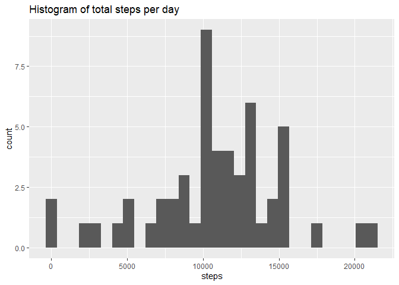

## Loading and preprocessing the data


```r
library(lubridate)
```

```
## Warning: package 'lubridate' was built under R version 4.1.3
```

```
## 
## Attaching package: 'lubridate'
```

```
## The following objects are masked from 'package:base':
## 
##     date, intersect, setdiff, union
```

```r
library(stringr)
activity <- read.csv("activity.csv")

##Creating a new ddataframe to stablish time
activity_dated <- activity

#Creating date
activity_dated$date <- ymd(activity$date)
##Adding time to date from interval column
hour(activity_dated$date) <- trunc(activity_dated$interval/100)
minute(activity_dated$date) <- as.numeric(str_sub(activity_dated$interval, -2,-1))

##Checking, do not evaluate
#str(activity_dated)
```

## What is mean total number of steps taken per day?

### Make a histogram of the total number of steps taken each day

Incorporating the data, preprocessing it and calculating total number of steps per day, then plotting the instagram:

```r
library(dplyr)
```

```
## 
## Attaching package: 'dplyr'
```

```
## The following objects are masked from 'package:stats':
## 
##     filter, lag
```

```
## The following objects are masked from 'package:base':
## 
##     intersect, setdiff, setequal, union
```

```r
library(ggplot2)
activity_grouped <- group_by(activity, date)
total_steps_day <- aggregate(steps~date, activity_grouped,sum, na.rm=TRUE)


ggplot(total_steps_day, aes(x = steps)) +
  geom_histogram() +
  ggtitle("Histogram of total steps per day")
```

```
## `stat_bin()` using `bins = 30`. Pick better value with `binwidth`.
```

<!-- -->

### Calculate and report the mean and median total number of steps taken per day
The mean of steps per day is 1.0766189\times 10^{4} and the median is 10765


## What is the average daily activity pattern?

```r
plot(activity_dated$date,activity_grouped$steps , type = "l")
```

<!-- -->

The 5 minutes interval with the maximum number of steps is 2012-11-27 06:15:00


## Imputing missing values

Total number of rows with NA: 2304

### Replacing NAs and creating new dataset with no NAs

We will use simply the average of steps for all intervals in all days.

```r
activity_dated_noNAs <- activity_dated

activity_dated_noNAs$steps[is.na(activity_dated_noNAs$steps)] <- mean(activity_dated_noNAs$steps, na.rm = TRUE)
```

### Making a histogram of the total number of steps in dataset with no NAs.


```r
library(dplyr)
library(ggplot2)
activity_dated_NoNAs_grouped <- group_by(activity_dated_noNAs, date(date))

total_steps_day_NoNas <- aggregate(steps~date(date), activity_dated_NoNAs_grouped,sum, na.rm=TRUE)


ggplot(total_steps_day_NoNas, aes(x = steps)) +
  geom_histogram() +
  ggtitle("Histogram of total steps per day")
```

```
## `stat_bin()` using `bins = 30`. Pick better value with `binwidth`.
```

<!-- -->

The mean of steps per day is 1.0766189\times 10^{4} and the median is 1.0766189\times 10^{4}

There are differences in the histogram, but not in the mean values (And very subtle differences in the median).
That is expected, the values for a single day will vary depending on the ammount of NAs present originally in that single day, and that will modify the histogram.
But replacing NAs (Which were not taken into account when calculating previously the mean) with the mean, cannot change the value of the mean.


## Are there differences in activity patterns between weekdays and weekends?


```r
#Creating factor column
activity_dated_NoNAs_grouped$day <- "Weekday"

activity_dated_NoNAs_grouped$day[weekdays(activity_dated_NoNAs_grouped$date) == "Saturday"] <- "Weekend"
activity_dated_NoNAs_grouped$day[weekdays(activity_dated_NoNAs_grouped$date) == "Sunday"] <- "Weekend"

activity_dated_NoNAs_grouped$day <- as.factor(activity_dated_NoNAs_grouped$day)


activity_dated_NoNAs_grouped <- group_by(activity_dated_NoNAs_grouped, date(date), interval)

total_steps_interval_NoNas <- aggregate(steps ~ interval + day, activity_dated_NoNAs_grouped, FUN = mean)

ggplot(total_steps_interval_NoNas, aes(x = interval, y = steps, colour = day)) +
  geom_line()
```

<!-- -->


